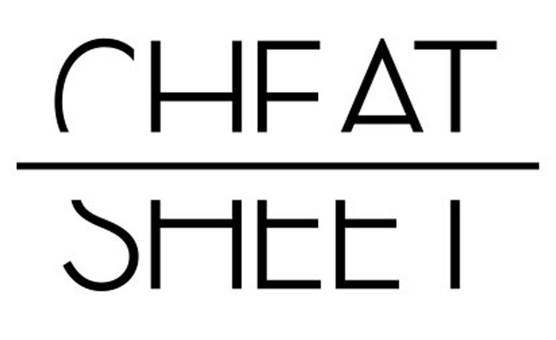

<!-- LOGO DO PROJETO -->
<h1 align="center">
   
  
   
  OD-Cheatsheets
   
</h1>

<h4 align="center">
  
🌐 Muitos *cheat sheets* básicos, fáceis e compactos para facilitar seu aprendizado.
  
</h4>

<!-- SHIELDS DO PROJETO -->

  
  
  
  
  

<!-- SUMÁRIO -->

  
<b>Sumário</b>

    <a href="#sobre-o-projeto">Sobre o Projeto</a> |
    <a href="#índice">Índice</a> |
    <a href="#contribuindo">Contribuindo</a> |
    <a href="#licença">Licença</a> |
    <a href="#contato">Contato</a> |
    

<!-- CORPO-->
## 📃 Sobre o Projeto

<table>
  <tr>
    <td>
    Este projeto foi desenvolvido com o objetivo de agrupar diversos cheatsheets relacionados à área de softwares e sistemas. :tophat:
      

      
Informações adicionais

       
        Texto da informações adicionais
      

    </td>
  </tr>
</table>

## 🔎 Índice

- [ex1](https://github.com/JonathanTSilva)
  - [ex1](https://github.com/JonathanTSilva)
- [Visual Studio Code]
- [Linux]
- [Terminal do Linux]
- [Vim]

## 🤝 Contribuindo

Se você quer contribuir com este projeto e aprimorá-lo, sua ajuda é sempre bem vinda! Por favor, leia as [diretrizes de contribuição][A] para contribuir corretamente. :tada:

<!-- LICENÇA -->

## 📝 Licença

Distribuída por **MIT License**. Veja [LICENSE][B] para mais informações.

## 📧 Contato

:globe_with_meridians: [Jonathan T. da Silva][C]  
:email: jonathantobias2009@hotmail.com  
:package: [JonathanTSilva/OD-Cheatsheets][D]

<!-- MARKDOWN LINKS>
<!-- SITES -->
[A]: https://github.com/JonathanTSilva/OD-Cheatsheets/blob/main/Docs/CONTRIBUTING.md
[B]: https://github.com/JonathanTSilva/OD-Cheatsheets/blob/main/LICENSE
[C]: https://www.linkedin.com/in/JonathanTSilva/
[D]: https://github.com/JonathanTSilva/OD-Cheatsheets

<!-- IMAGENS -->
